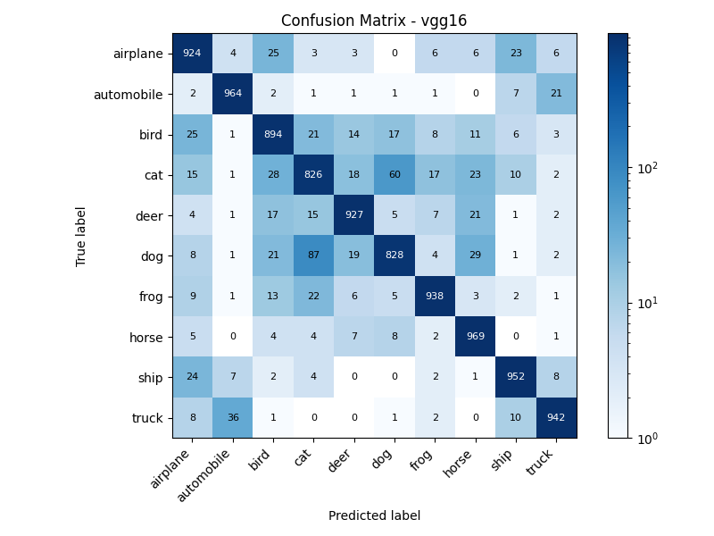
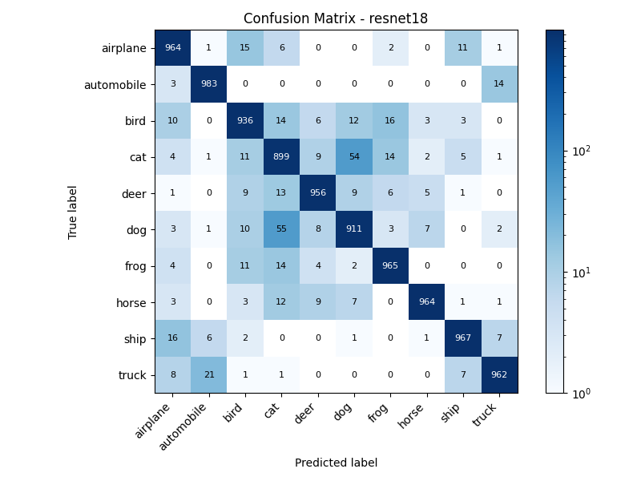
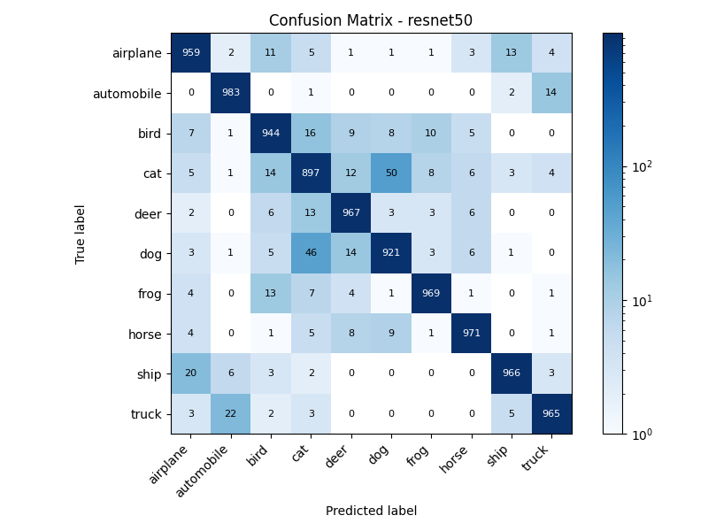
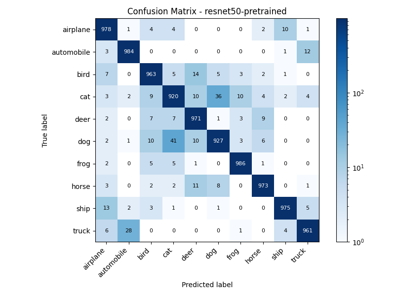

# CNN Architecture & Transfer Learning Comparison

*A comparative study of CNN architecture evolution, model depth, and transfer learning on CIFAR-10.*

本项目在CIFAR-10数据集上训练并比较从零训练的VGG16、ResNet-18、ResNet-50以及从ImageNet迁移学习来的ResNet-50的性能表现。

从而研究迁移学习、架构演进、模型深度，对模型表现的影响。

## 1. 验证集准确率（val_acc）

| 模型                      | val_acc    |
| ----------------------- | ---------- |
| **VGG16**               | **0.9196** |
| **ResNet18**            | **0.9504** |
| **ResNet50**            | **0.9538** |
| **ResNet50-pretrained** | **0.9632** |

---

## 2.混淆矩阵（Confusion Matrix）

### VGG16

### ResNet18

### ResNet50

### ResNet50-pretrained

